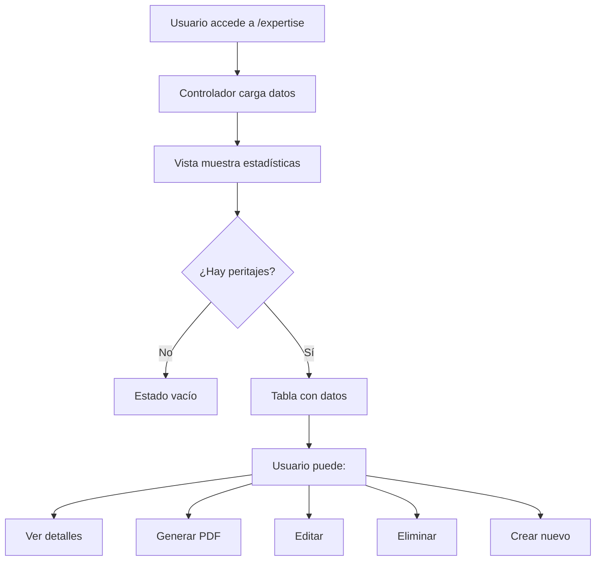

# 📋 Módulo de Listado de Peritajes Completos

## Descripción
Vista principal que muestra todos los peritajes completos registrados en el sistema con funcionalidades de búsqueda, filtrado y acceso rápido a acciones.

## 📁 Archivos Relacionados

### Controlador
- **Archivo**: `app/controllers/ExpertiseController.php`
- **Método**: `index()`
- **Descripción**: Obtiene todos los peritajes con datos relacionados (cliente, tipo de vehículo, contadores)

### Vista
- **Archivo**: `app/views/expertise/index.php`
- **Componentes**: 
  - Estadísticas rápidas (4 cards)
  - Tabla de listado con filtros
  - Modal de confirmación de eliminación

### Rutas
- **Listado**: `GET /expertise` → `ExpertiseController@index`
- **Ver detalle**: `GET /expertise/view/{id}` → `ExpertiseController@view` *(Pendiente)*
- **Generar PDF**: `GET /expertise/pdf/{id}` → `ExpertiseController@pdf` *(Pendiente)*
- **Editar**: `GET /expertise/edit/{id}` → `ExpertiseController@edit` *(Pendiente)*
- **Eliminar**: `POST /expertise/delete/{id}` → `ExpertiseController@delete` *(Pendiente)*

## 🎨 Características

### 1. Estadísticas Rápidas
```php
- Total Peritajes: Contador total de registros
- Este Mes: Peritajes creados en el mes actual
- Total Inspecciones: Suma de todas las inspecciones realizadas
- Total Fotos: Suma de todas las fotos subidas
```

### 2. Filtros de Búsqueda
- **Búsqueda en tiempo real**: Por placa, cliente, servicio, marca, modelo
- **Filtro por mes**: Dropdown con los meses que tienen peritajes registrados
- **Contador dinámico**: Muestra el número de registros visibles

### 3. Tabla de Datos
Columnas mostradas:
- ID del peritaje
- Fecha del servicio
- Número de servicio
- Información del vehículo (placa, marca, modelo, año, tipo)
- Datos del cliente (nombre, teléfono)
- Contador de inspecciones
- Contador de fotos
- Botones de acción

### 4. Acciones Disponibles
```html
👁️ Ver - Ver detalles completos del peritaje
📄 PDF - Generar y descargar reporte en PDF
✏️ Editar - Modificar datos del peritaje
🗑️ Eliminar - Eliminar peritaje (con confirmación)
```

## 🗄️ Consulta SQL Principal

```sql
SELECT 
    e.id,
    e.service_date,
    e.service_number,
    e.placa,
    e.marca,
    e.modelo,
    e.anio,
    e.kilometraje,
    e.vin,
    e.motor,
    e.color,
    c.nombre as cliente_nombre,
    c.apellido as cliente_apellido,
    c.correo as cliente_correo,
    c.telefono as cliente_telefono,
    vt.nombre as tipo_vehiculo_nombre,
    e.created_at,
    e.updated_at,
    (SELECT COUNT(*) FROM expertise_inspections ei WHERE ei.expertise_id = e.id) as total_inspecciones,
    (SELECT COUNT(*) FROM expertise_photos ep WHERE ep.expertise_id = e.id) as total_fotos
FROM expertises e
LEFT JOIN clients c ON e.client_id = c.id
LEFT JOIN vehicle_types vt ON e.tipo_vehiculo_id = vt.id
ORDER BY e.created_at DESC
```

## 📱 Navegación en el Sidebar

```html
Peritajes (Dropdown)
├── 📄 Peritaje Completo → /expertise (Lista completa)
└── 📋 Peritaje Básico → (Próximamente)
```

## 🎯 Estados de la Vista

### Estado Vacío
Cuando no hay peritajes registrados:
- Icono grande de clipboard
- Mensaje: "No hay peritajes completos registrados"
- Botón: "Crear Primer Peritaje"

### Estado con Datos
Cuando existen peritajes:
- Muestra estadísticas en 4 cards
- Barra de búsqueda y filtro por mes
- Tabla completa con todos los registros
- Botón "Nuevo Peritaje Completo" en el header

## 🔄 Flujo de Trabajo



## 🚀 Funcionalidades JavaScript

### Búsqueda en Tiempo Real
```javascript
searchInput.addEventListener('keyup', filterTable)
// Filtra por cualquier texto visible en la fila
```

### Filtro por Mes
```javascript
filterMonth.addEventListener('change', filterTable)
// Usa el atributo data-month de cada fila
```

### Contador Dinámico
```javascript
resultCount.textContent = visibleCount + ' registro(s)'
// Se actualiza con cada filtro aplicado
```

### Modal de Eliminación
```javascript
deleteExpertise(id)
// Muestra modal de confirmación antes de eliminar
// Advertencia: elimina también inspecciones y fotos
```

## 📊 Badges de Información

### Número de Servicio
```html
<span class="badge bg-secondary">SRV-2024-001</span>
```

### Tipo de Vehículo
```html
<span class="badge bg-light text-dark">Automóvil</span>
```

### Inspecciones
```html
<span class="badge bg-info">45</span>
```

### Fotos
```html
<span class="badge bg-warning text-dark">12</span>
```

## 🎨 Estilos Personalizados

```css
.border-left-primary { border-left: 4px solid #4e73df; }
.border-left-success { border-left: 4px solid #1cc88a; }
.border-left-info { border-left: 4px solid #36b9cc; }
.border-left-warning { border-left: 4px solid #f6c23e; }
```

## 🔜 Funcionalidades Pendientes

1. **Vista de Detalle** (`view.php`)
   - Mostrar toda la información del peritaje
   - Inspecciones agrupadas por sección
   - Galería de fotos
   - Datos del cliente y vehículo

2. **Generación de PDF** (`pdf()`)
   - Reporte completo en PDF
   - Logo y membrete
   - Todas las secciones del peritaje
   - Fotos incluidas

3. **Edición** (`edit()`)
   - Cargar datos existentes en los pasos
   - Permitir modificación
   - Actualizar registros en BD

4. **Eliminación** (`delete()`)
   - Validación de permisos
   - Eliminación en cascada
   - Eliminar fotos del servidor
   - Confirmación de eliminación

## 📝 Notas Importantes

- **Performance**: La consulta usa subconsultas para contar inspecciones y fotos. Considerar índices en `expertise_id` si la BD crece mucho.
- **Filtro de Mes**: Usa `strftime()` que puede no estar disponible en todos los servidores. Alternativa: usar `date()`.
- **Modal**: Requiere Bootstrap 5 JavaScript para funcionar correctamente.
- **SweetAlert2**: Usado para mensajes de éxito/error al guardar peritajes.

## 🔐 Seguridad

- ✅ Verificación de sesión activa en el constructor
- ✅ Token CSRF en formularios de eliminación
- ✅ Escapado HTML con `htmlspecialchars()`
- ✅ Prepared statements en consultas SQL
- ⚠️ Falta validación de permisos por rol (futuro)

---

**Última actualización**: 2024
**Versión**: 1.0
**Estado**: ✅ Funcional (Acciones pendientes de implementar)
